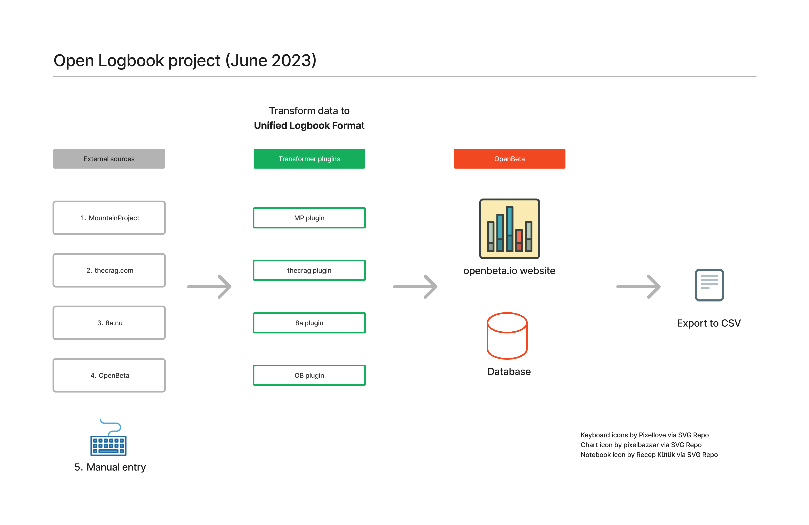

# Overview
A proposed open standard for climb logbook.

### What we're trying to solve?
- Publish an open format for logging climbs.
- Sync your ticks and climb logs from other platforms.
- Keep your data in one single location.
- Data privacy and ownership: own your data and only share what you want.
- Open source: visualize your progress with community charts or build your owns.

# Join the conversation
Discord invite: https://discord.gg/xcWha22BhT
